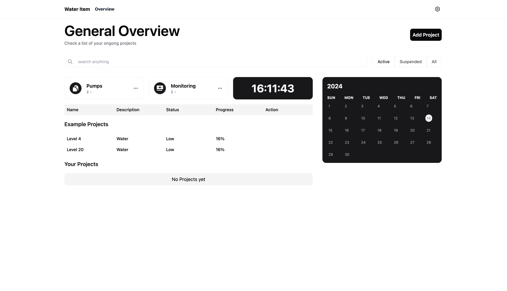

# Interview

## Start the application

Run `npx nx dev market-research` to start the development server!
Item will be running on localhost:3000

## Build for production

Run `npx nx build market-research` to build the application. The build artifacts are stored in the output directory (e.g. `dist/` or `build/`), ready to be deployed.

###
